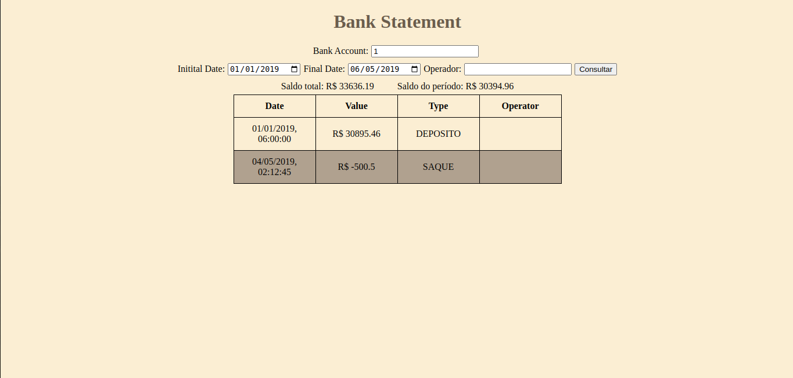

# Bank Statement

Aqui você encontrará os detalhes sobre o projeto: como instalar, executar, funcionalidades, recursos e tecnologias utilizadas.

## Introdução

O **Bank Statement** é uma interface que consome dados da API **Bank Statement** e exibe o extrato de transações de uma conta bancária. A interface solicita o ID da conta e, opcionalmente, período do extrato e nome do operador, a fim de buscar as transações de acordo com tais critérios.

## Instalação e execução

1. Inicialmente, clone o repositório com o comando `git clone git@github.com:stonefullstm/bank-front.git`
2. Na raiz do repositório clonado, execute `npm install` a fim de instalar as dependências
3. Execute `npm run dev` para iniciar a aplicação
4. A aplicação deve executar no navegador em `http://localhost:5173/`

## Funcionalidades

A partir da tela inicial

a aplicação pode ser executada nas seguintes maneiras:

1. Digite um ID em `Bank Account` e clique no botão `Consultar` para retornar todos os lançamentos existentes para esta conta.  

2. Se desejar os lançamentos apenas de um dado operador, digite, além do ID da conta o nome do operador em `Operator` e clique no botão em seguida.

3. Digite o ID da conta e o período desejado em `Initial Date` e `Final Date` para buscar os lançamentos de um período.

4. Informe todos os campos e serão buscados os lançamentos de uma conta, num dado período e operador.

## Tecnologias utilizadas

Linguagem de programação [Javascript](https://developer.mozilla.org/pt-BR/docs/Web/JavaScript), a biblioteca front end  [React.js](https://react.dev/), e a ferramenta de construção [Vite.js](https://vitejs.dev/). Além destas, para os testes, foi utilizado o framework [Vitest](https://vitest.dev/) e a biblioteca de mock de API [MSW](https://mswjs.io/).